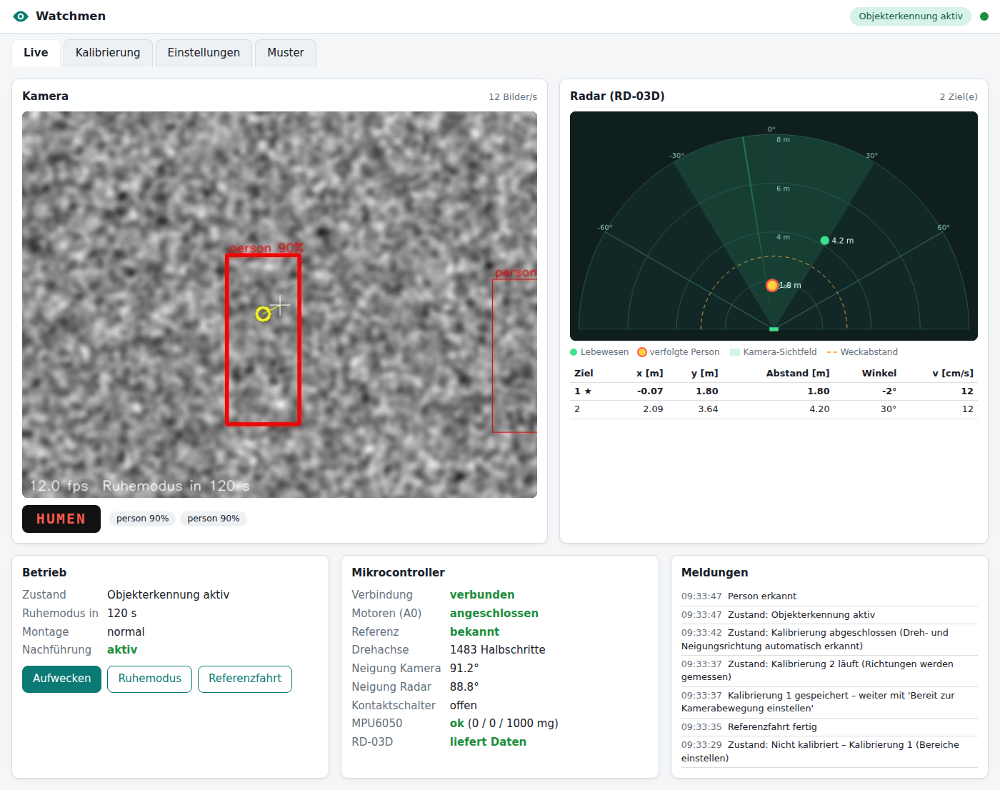
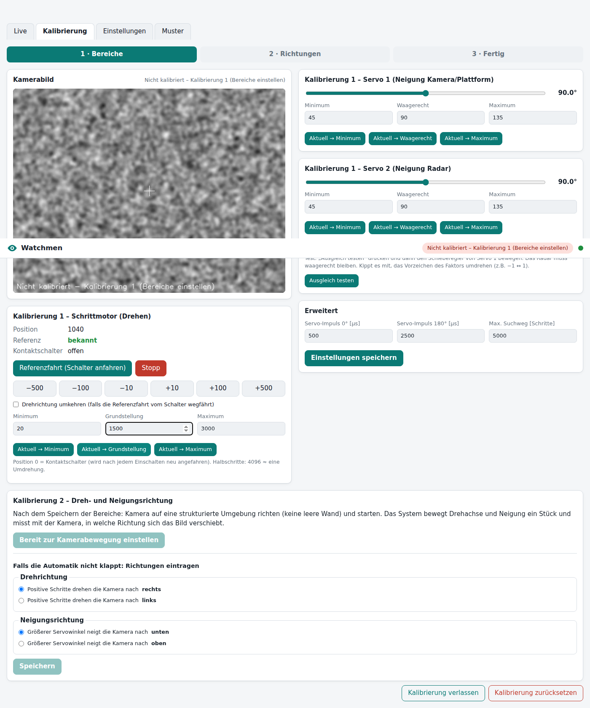

# Watchmen

Anwendung für den **Arduino UNO Q** (2 GB) mit **UNO Media Carrier** und IMX219-Kamera: Eine
dreh- und neigbare Plattform erkennt **Personen**, **Autos** und ein **markantes Muster**
(ArUco-Marker), folgt Personen bzw. dem Muster mit der Kamera, nutzt ein **AI-Thinker RD-03D**
Human-Radar zur Auswahl der nächsten Person, spart im **Ruhemodus** Strom und wird über Radar oder
Vibration (MPU6050) wieder geweckt. Kalibrierung und Live-Ansicht laufen über eine Webseite, die
der UNO Q selbst ausliefert. Dazu gibt es ein passendes **Shield (KiCad-Projekt)**.



## Inhalt

| Ordner | Inhalt |
|---|---|
| `app.yaml` | App-Beschreibung für Arduino App Lab (Bricks: `web_ui`, `object_detection`) |
| `sketch/` | Mikrocontroller-Teil (STM32U585): Servos, Schrittmotor, Schalter, WS2812B, LED-Matrix, RD-03D, MPU6050, A0 |
| `python/` | Linux-Teil: Zustandsmaschine, Kamera, Erkennung, Nachführung, Radar, Kalibrierung, Webschnittstelle |
| `assets/` | Webseite (Live-Bild, Halbkreis-Radar, Kalibrierung, Einstellungen, Marker-Druck) |
| `hardware/` | Shield für den UNO Q in zwei Versionen (v1 mit, v2 ohne Fenster über der LED-Matrix): Schaltplan, Platine, Gerber – siehe [hardware/README.md](hardware/README.md) |
| `docs/` | [Verdrahtung und Pinbelegung](docs/Verdrahtung.md), Bilder |
| `tests/` | Simulationstests für Sketch, Python-Logik und Webseite |

Der gesamte Code im Sketch und in `python/` ist **Zeile für Zeile auf Deutsch kommentiert**.

## Systemaufbau

```
           Linux (QRB2210, Debian, Python)                       MCU (STM32U585, Zephyr-Sketch)
 ┌───────────────────────────────────────────────┐   Bridge   ┌──────────────────────────────────┐
 │ controller.py  Zustände, Ruhemodus, Ausgaben  │◄──────────►│ Servos (A1, A2) sanft + Ausgleich │
 │ vision.py      Kamera IMX219, ArUco, KI       │  (RPC)     │ 28BYJ-48 + Referenzfahrt (D2)     │
 │ tracker.py     Nachführung (P-Regler)         │            │ WS2812B über SPI-MOSI (D11)       │
 │ radar.py       RD-03D-Ziele, nächste Person   │            │ LED-Matrix-Text / Lauftext        │
 │ calibration.py Kalibrierung 2 (automatisch)   │            │ RD-03D (Serial1, 256000 Baud)     │
 │ webapi.py      Webseite, MJPEG, Marker-PNG    │            │ MPU6050: Vibration + Lage         │
 │ config.py      /app/data/watchmen_config.json │            │ A0: Motoren angeschlossen?        │
 └───────────────────────────────────────────────┘            └──────────────────────────────────┘
        ▲ http://<UNO-Q>:7000 (Socket.IO + MJPEG)
```

Zeitkritisches (Schrittimpulse, Servo-Rampen, LED-Timing, Radar-Protokoll, Vibration) erledigt der
Mikrocontroller. Entscheidungen (Kalibrierung, Erkennung, Ruhemodus) trifft die Linux-Seite.

## Inbetriebnahme

1. **Kamera am Media Carrier aktivieren** (App Lab ≥ Image 523): *Einstellungen (Zahnrad) → Carriers →
   „Enable external carriers …“* einschalten, für **Camera0** `type1-2lanes` (IMX219) wählen,
   *Apply and reboot*.
2. **App auf den UNO Q bringen**, z. B. im Terminal des UNO Q:
   ```bash
   cd ~/ArduinoApps && git clone https://github.com/Codexzier/Watchmen.git watchmen
   ```
   Danach erscheint die App in App Lab unter *My Apps*. Beim ersten Start lädt App Lab die Bricks
   (Webserver, Objekterkennung mit YOLOX-Modell) und die Sketch-Bibliotheken (`Servo`, `ArduinoGraphics`).
3. **Starten** und im Browser `http://<IP-des-UNO-Q>:7000` öffnen.
4. Verdrahtung siehe [docs/Verdrahtung.md](docs/Verdrahtung.md) – mit dem Shield ist alles gesteckt.

## Ablauf und Anzeigen

| Zustand | LED 1 | LED 2 | LED-Matrix |
|---|---|---|---|
| Start / nicht kalibriert / Kalibrierung | rot blinkend | rot blinkend | – |
| Referenzfahrt nach dem Einschalten | türkis blinkend | türkis blinkend | – |
| Kalibrierung abgeschlossen | grün (5 s) | grün (5 s) | – |
| Erkennung aktiv, nichts im Bild | aus | aus | – |
| **Auto** erkannt | **blau** | aus | `CAR` |
| **Person** erkannt (Kamera folgt) | **rot** | aus | `HUMEN` (Lauftext) |
| **Muster** erkannt (Kamera hält es mittig) | weiß | aus | `MARK` |
| **Ruhemodus** (1 min nichts erkannt) | aus | **orange blinkend, 1 Hz** | – |
| **Vibration** über Schwellwert | beide **3× lila** | | |
| Fehler (Schalter nicht gefunden) | rot schnell | rot schnell | `ERR` |

Priorität: **Muster > Person > Auto**. Texte, Schwellwerte usw. sind auf der Webseite einstellbar.

* **Ruhemodus**: Nach 60 s ohne Erkennung wird die Kamera abgeschaltet, Kamera- und Radar-Servo gehen
  waagerecht, die Spulen des Schrittmotors werden stromlos.
* **Aufwachen**: ein Lebewesen im Radar näher als *Weckabstand* (Standard 3 m), mit mindestens
  *Mindestgeschwindigkeit* in *N* Meldungen hintereinander – **oder** eine Vibration über der
  *Vibrationsschwelle* (Standard 150 mg). Beides ist einstellbar.
* **Mehrere Personen**: Die Radar-Ziele werden über ihren Winkel den Personen im Bild zugeordnet; die
  Kamera folgt der **nächsten** Person. Ohne Radar-Zuordnung wird die größte (vermutlich nächste) gewählt.
  Die Webseite zeigt das Radar als Halbkreis mit allen Zielen, der verfolgten Person, dem Kamera-
  Sichtfeld und dem Weckabstand.
* **Deckenmontage** (Sonderpunkt 2): Zeigt der MPU6050 „kopfüber“, wird das Kamerabild um 180°
  gedreht. Die Nachführung rechnet intern im Rohbild weiter, die Kalibrierung bleibt gültig.
* **Ohne Motoren** (Sonderpunkt 1): Liegen an A0 keine 3,3 V an, gibt es keine Kalibrierung und keine
  Bewegung – Erkennung, Anzeige, Ruhemodus und Wecken funktionieren trotzdem.

## Kalibrierung



**Kalibrierung 1 – Bereiche** (Reiter *Kalibrierung*):

1. *Referenzfahrt* drücken: Die Drehachse fährt bis zum Kontaktschalter (= Position 0). Fährt sie in
   die falsche Richtung, *Stopp*, „Drehrichtung umkehren“ setzen und erneut starten.
2. Mit den Schiebereglern Servo 1 (Kamera) und Servo 2 (Radar) bewegen und mit *Aktuell → Minimum /
   Waagerecht / Maximum* die Grenzen übernehmen.
3. Mit den Jog-Tasten die Drehachse an die Grenzen fahren und *Minimum / Grundstellung / Maximum*
   übernehmen.
4. *Ausgleich testen* drücken und Servo 1 bewegen: Das Radar muss waagerecht bleiben. Kippt es mit,
   das Vorzeichen des Ausgleichsfaktors umdrehen.
5. **Einstellungen speichern**.

**Kalibrierung 2 – Richtungen**: Kamera auf eine strukturierte Umgebung richten und
**„Bereit zur Kamerabewegung einstellen“** drücken. Das System dreht und neigt um je 6° hin und zurück
und misst per Phasenkorrelation, wohin und wie weit sich das Bild verschiebt (Richtung *und* Maßstab).
Klappt das (Plausibilitätsprüfung), ist die Kalibrierung abgeschlossen. Sonst die beiden Richtungen
von Hand eintragen und **Speichern** drücken. Danach leuchten beide LEDs 5 s grün und die
Objekterkennung startet.

Nach jedem Einschalten wird bei abgeschlossener Kalibrierung zuerst automatisch die Referenzfahrt
ausgeführt (Offset des Schrittmotors), danach startet die Erkennung.

## Das Muster (ArUco-Marker)

Reiter *Muster*: Marker anzeigen und ausdrucken (Standard: Wörterbuch `DICT_4X4_50`, jede ID). Der
weiße Rand muss erhalten bleiben. Sobald der Marker im Bild ist, hat er Vorrang vor allem anderen.

## Tests (am PC, ohne Hardware)

```bash
# Sketch mit Ersatz-Headern übersetzen und Hardware simulieren (g++)
tests/host_sketch/run_tests.sh

# Python-Logik mit simuliertem Mikrocontroller, Kamera-Welt und KI (numpy, opencv-python-headless, fastapi)
python3 tests/python/test_system.py

# Webseite mit simulierter Hardware ausprobieren (zusätzlich uvicorn, python-socketio)
python3 tests/python/sim_server.py --port 7000     # dann http://localhost:7000

# Browser-Test der Webseite (zusätzlich playwright + Chromium)
python3 tests/python/ui_check.py
```

Abgedeckt sind u. a.: Referenzfahrt inkl. Schrittverlust, Rampen, Servo-Grenzen und Radar-Ausgleich,
RD-03D-Rahmen, WS2812-Bitmuster, Matrix-Text, Vibration, A0-Erkennung; in Python die komplette
Kalibrierung (automatisch und von Hand), Verfolgen von Person und Muster (auch kopfüber), Auswahl der
nächsten Person per Radar, Ruhemodus und Wecken per Radar/Vibration, Betrieb ohne Motoren und Neustart.

## Was vor dem Einsatz am echten Gerät zu prüfen ist

Die Software wurde gegen die offiziellen Quellen (App-Lab-Bricks, Arduino Zephyr-Core,
RouterBridge, Servo-Bibliothek) geschrieben und in Simulationen getestet. Auf echter Hardware
konnte ich sie nicht laufen lassen; ein Übersetzen mit der originalen Arduino-Toolchain war in meiner
Umgebung nicht möglich (Download gesperrt). Besonders beachten:

* Beim ersten Übersetzen in App Lab eventuelle Compiler-Meldungen prüfen.
* **WS2812B**: Das SPI-Timing geht von 5 MHz SPI-Takt aus (SPI2 an 160 MHz). Falsche Farben →
  Pegelwandler und Verdrahtung prüfen.
* **RD-03D**: Seitenrichtung je nach Einbau → ggf. „Radar-X-Achse spiegeln“.
* **MPU6050**: „oben“-Achse passend zur Einbaulage einstellen (siehe Verdrahtung).
* **Shield v1**: Lage des Fensters über der LED-Matrix mit der 1:1-Vorlage prüfen (siehe
  [hardware/README.md](hardware/README.md)). Das Shield v2 hat kein Fenster und verdeckt die Matrix.
