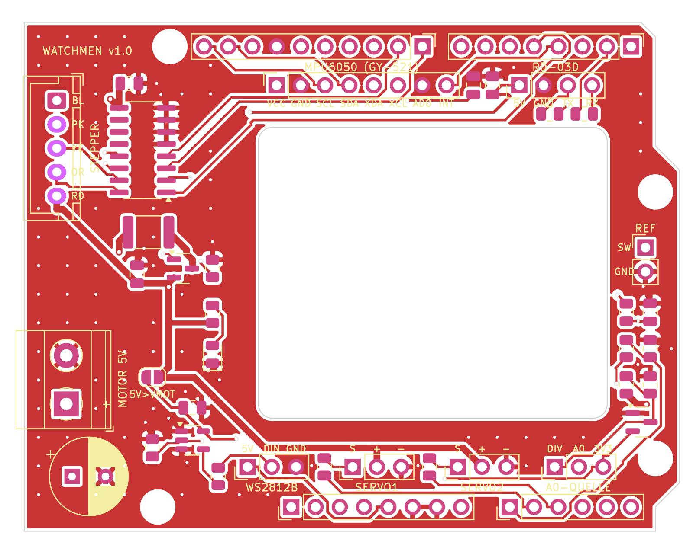

# Watchmen-Shield (KiCad)

Shield im UNO-Formfaktor für den **Arduino UNO Q** mit allen Anschlüssen des Watchmen-Systems.
Schaltplan und Platine werden vollständig aus `generator/shield_design.py` erzeugt – Bauteile,
Netze und Platzierung stehen nur dort.



## Inhalt

| Pfad | Inhalt |
|---|---|
| `watchmen-shield/watchmen-shield.kicad_pro/.kicad_sch/.kicad_pcb` | KiCad-7-Projekt (mit KiCad 7, 8 oder 9 zu öffnen) |
| `watchmen-shield/docs/schaltplan.pdf` · `schaltplan.png` | Schaltplan |
| `watchmen-shield/docs/platine_oben.png` · `platine_unten.png` | Ansicht der Kupferlagen |
| `watchmen-shield/docs/bestueckungsplan.pdf` | Bestückungsplan (Referenzen auf der Fab-Lage) |
| `watchmen-shield/docs/outline_1zu1.pdf` | **1:1-Prüfvorlage** (Kontur, Fenster, Löcher) |
| `watchmen-shield/docs/drc_bericht.txt` | Design-Rule-Check (siehe unten) |
| `watchmen-shield/fabrication/watchmen-shield-gerber.zip` | Gerber + Bohrdaten für den Leiterplattenhersteller |
| `watchmen-shield/fabrication/*-stueckliste.csv` | Stückliste |
| `watchmen-shield/fabrication/*-bestueckung.csv` | Bestückungsdaten (Position/Drehung) |
| `generator/` | Generator-Skripte |

## Eckdaten

* 2 Lagen, 1,6 mm, 68,6 × 53,3 mm (UNO-Kontur), Leiterbahnen ≥ 0,25 mm, Abstände ≥ 0,2 mm,
  Vias 0,6/0,3 mm – bei allen gängigen Herstellern (z. B. JLCPCB, Aisler, PCBWay) im Standardprozess.
* Motor-Versorgung (VMOT) 0,7 mm breit, 5 V und Spulen 0,3 mm, Masse als Kupferfläche auf beiden Seiten.
* SMD-Bauteile in 0805 / SOT-23 / SOIC-16 (handlötbar), Steckverbinder in THT.
* **DRC: 0 Verstöße, 0 offene Verbindungen.** Der Bericht listet zusätzlich nur Hinweise, die in
  der Projektdatei ausgeblendet sind (Bibliotheksvergleich, sich berührende Beschriftungen).

## Vor der Bestellung prüfen (wichtig!)

1. **Fenster für die LED-Matrix**: Das Shield hat einen Ausschnitt (36,5 × 30,5 mm, x = 24,5…61 mm,
   y = 11…41,5 mm von links oben, USB-C links), damit die 13×8-Matrix des UNO Q sichtbar bleibt.
   Die genaue Lage der Matrix konnte ich nicht aus einer Maßzeichnung übernehmen.
   → `docs/outline_1zu1.pdf` in **Originalgröße (100 %)** drucken, ausschneiden, auf den UNO Q legen.
   Passt das Fenster nicht, in `generator/shield_design.py` den Wert `WINDOW` ändern und neu erzeugen.
2. **Löcher H2/H3** liegen (wie beim Original-UNO) sehr nah an den Stiftleisten SCL bzw. A5.
   Dort Kunststoffschrauben/-abstandshalter M2,5–M3 mit kleinem Kopf verwenden.
3. **Höhe**: Das Shield sitzt auf den Buchsenleisten des UNO Q (ca. 8,5 mm). Die Schraubklemme J5
   ragt links 1,3 mm über die Kontur (über der USB-C-Buchse, mechanisch unkritisch).
4. Stiftleisten zum UNO Q mit langen Pins (oder Stapel-Buchsenleisten) verwenden.

## Bestückung – Hinweise

| Teil | Wert | Hinweis |
|---|---|---|
| Q1 | AO3401A (P-MOSFET) | Verpolschutz der Motor-Versorgung |
| F1 | Polyfuse 1812, 2,6–3 A Haltestrom | z. B. Littelfuse 1812L260 oder 1812L300 |
| C1 | 470 µF / ≥ 10 V, Ø 8 mm, RM 3,5 | Polarität beachten (+ markiert) |
| U1 | ULN2003A (SOIC-16) | |
| U2 | 74AHCT1G125 (SOT-23-5) | Pegelwandler für WS2812B – **AHCT**, nicht AHC/LVC |
| D2 | BAT54S | Klemmdiode für A0 |
| R3/R4 | 15 kΩ / 33 kΩ | Teiler VMOT → A0 (5 V → ca. 3,1 V) |
| J6 | JST XH 5-polig (B5B-XH-A) | passt zum Stecker des 28BYJ-48 |
| J11 | Buchsenleiste 1×8 | für GY-521-Modul |
| JP1 | Stiftleiste 1×3 + Jumper | Stellung DIV–A0 = automatische Motorerkennung |
| JP2 | Lötbrücke | normalerweise **offen** lassen |

## Neu erzeugen

Voraussetzungen: KiCad 7 (mit Python-Modul `pcbnew`), Java 25 und
[Freerouting](https://freerouting.app) 2.4 (`freerouting-2.4.1-executable.jar`, z. B. von Maven Central).

```bash
/usr/bin/python3 hardware/generator/build_shield.py \
    --freerouting /pfad/freerouting-2.4.1-executable.jar \
    --java /usr/lib/jvm/java-25-openjdk-amd64/bin/java
```

Ablauf: Schaltplan schreiben → Netzliste mit `kicad-cli` exportieren und gegen den Entwurf prüfen →
Platine aufbauen (Kontur, Fenster, Bauteile, Netzklassen) → Autorouting (Signale und Versorgung;
Masse wird nicht geroutet) → Masse-Vias an jedem SMD-Masse-Pad, verteilte Vias und Insel-Prüfung →
Masseflächen → DRC → Gerber/Bohrdaten/PDF/SVG. Ohne `--freerouting` bzw. mit `--no-route` entsteht
nur die platzierte, ungeroutete Platine (z. B. um in KiCad von Hand zu routen).
